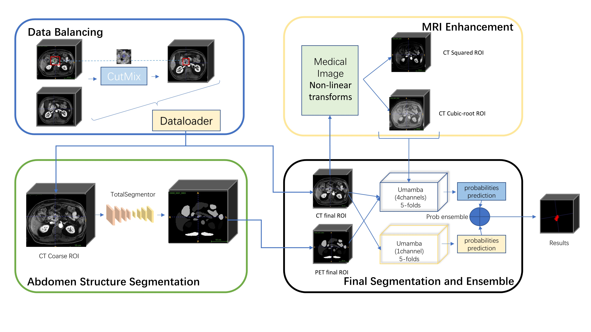

# PANTHER Challenge 2025 Solution - SJTU Lab426


*Official solution for the PANTHER 2025 Medical Image Segmentation Challenge*

## Table of Contents
- [Data Source](#data-source)
- [Quick Start](#quick-start)
- [Model Training](#model-training)
- [Methodology](#methodology)
- [License](#license)

## Data Source
Dataset provided by the [PANTHER 2025 Challenge](https://panther.grand-challenge.org/).  
Please register on the challenge website to access the data.

## Quick Start
### Docker Deployment
Download docker image from [Final docker](https://drive.google.com/drive/folders/16Uwd7yQhZPQUJBq_J2CfcuoD0uVen27T?usp=drive_link)

```bash
# Run inference
bash run_docker.sh
```

> **Note**: Ensure you have NVIDIA Docker runtime installed for GPU acceleration.

## Model Training
### Pipeline Overview


### Requirements
1. Set up conda environment following [U-Mamba official Repo](https://github.com/bowang-lab/U-Mamba)
2. Prepare data in nnUNet-compatible format:
   ```
   Dataset/
   ├── imagesTr/  # Training images
   ├── labelsTr/  # Training labels
   └── dataset.json
   ```

### Preprocessing
1. **Data Augmentation**:
   ```bash
   # CutMix augmentation
   python cutmix_pipeline.py

   # Additional offline augmentation
   python offline_augmentation.py \
     --input_dir /path/to/input \
     --output_dir /path/to/output \

After you prepare was done, just follow the U-mamba to train a single modality model and multi-modality model.


